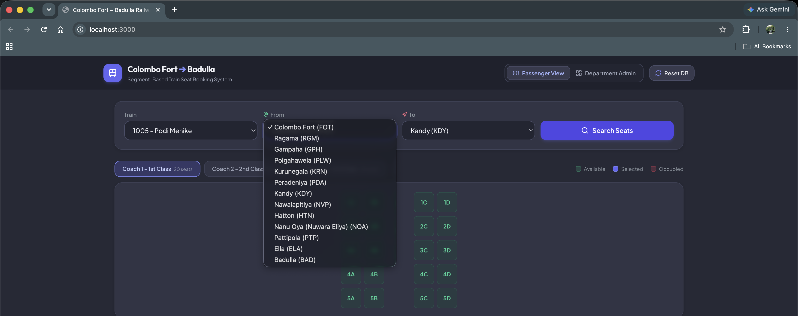
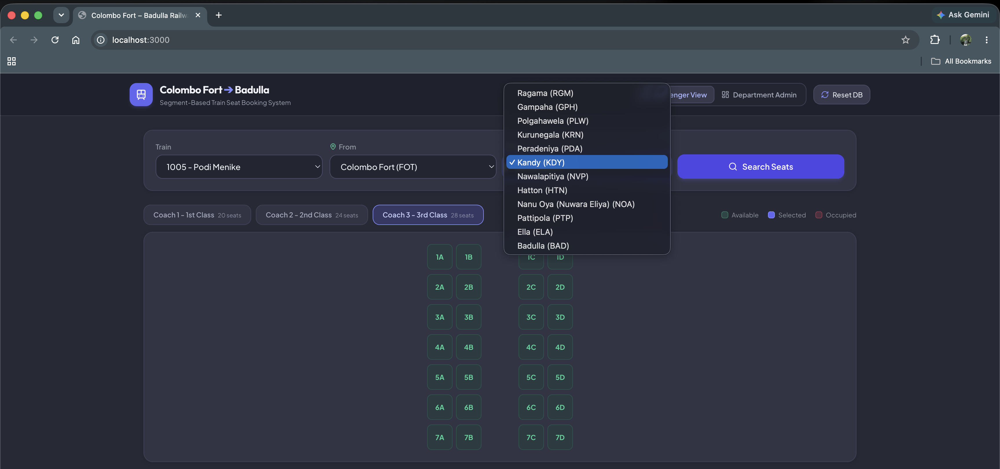
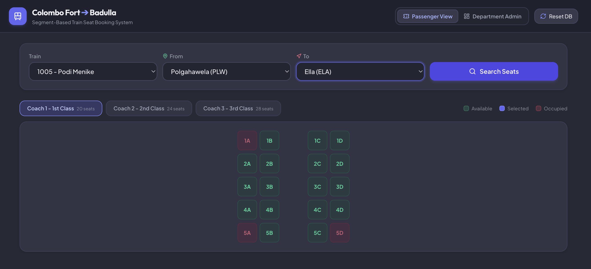
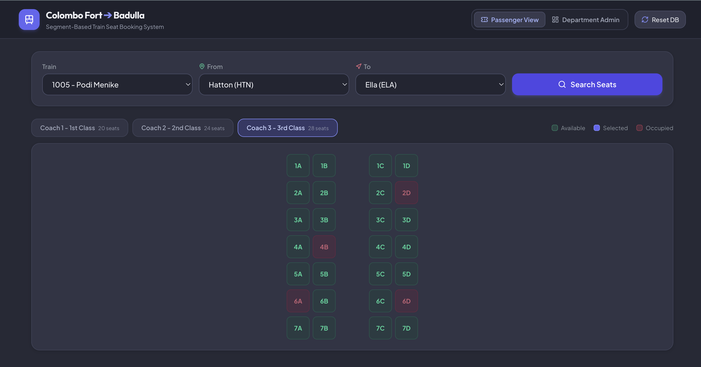
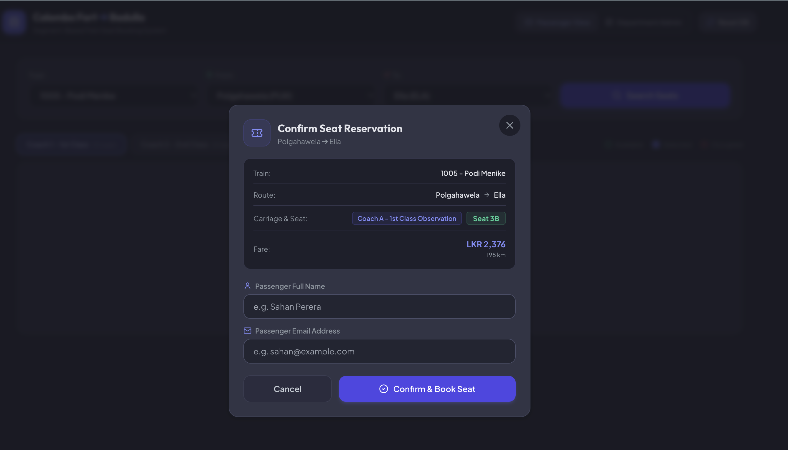
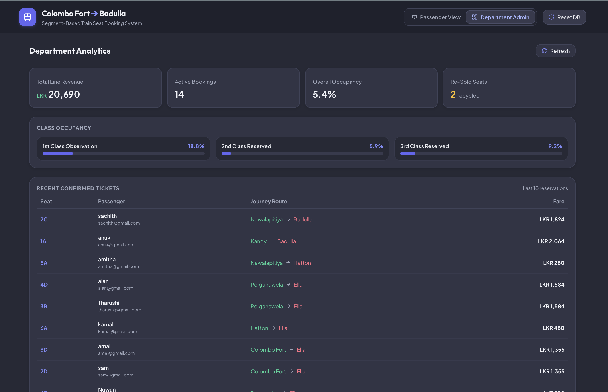

# 🚆 Segment-Based Train Seat Booking System

A booking system for Sri Lanka's **Colombo Fort – Badulla** railway line that allows a single reserved seat to be booked independently by different passengers for non-overlapping legs of the same journey.

Traditional booking systems lock a seat for the entire route. On a 292 km line with 13 stops, a passenger traveling only the first two stops wastes the seat for the remaining eleven. This system solves that problem: Passenger A books Seat 1A from Colombo Fort → Kandy, and Passenger B books the same seat from Kandy → Badulla. Both are valid because their segments don't overlap.

The core technical challenge is enforcing this non-overlap invariant under concurrent access — two users booking the same seat for overlapping segments at the same instant. The system delegates this entirely to PostgreSQL's native range exclusion constraints, making double-bookings impossible at the database engine level.

---

## Features

### Core Features

- Segment-based seat booking - one seat, multiple non-overlapping passengers
- Interactive 2D seat map with per-coach carriage layouts (1st, 2nd, 3rd class tabs)
- Real-time segment availability - a seat booked for Colombo → Kandy still shows available for Kandy → Badulla
- Overlap conflict tooltips on occupied seats showing which segments are taken
- Distance-based fare calculation using real cumulative station distances and class multipliers
- Database-level concurrency protection
- Conflict responses for overlapping booking attempts
- Configurable stations, coaches, and seats (database-driven, not hardcoded)
- One-click database reset and re-seed

### Additional Features

- Department Admin Dashboard with revenue KPIs, class occupancy breakdown, and recent reservations
- Dual-view toggle (Passenger View / Department Admin) in the header
- Notification system for booking confirmations and conflict alerts
- Supports multiple train schedules, each with its own unique configuration
- Auto-seed on first boot - `docker compose up` just works with zero configuration

---

## Tech Stack

| Layer | Technology |
|-------|-----------|
| Frontend | React, TypeScript, Tailwind CSS|
| Backend | Node.js, Express, TypeScript |
| Database | PostgreSQL |
| Infrastructure | Docker Compose |

---

## Core Design Decisions

### 1. Segment-Based Booking Model

> The core requirement of this project is allowing a single reserved seat to be booked by multiple passengers as long as their journeys do not overlap. Each booking is represented using the origin and destination station sequence numbers as a half-open interval ([from, to)). 
>
> This approach allows adjacent journeys - for example, Colombo Fort → Kandy followed by Kandy → Badulla—to reuse the same seat without conflict while correctly rejecting overlapping reservations. It provides a simple and reliable representation of seat occupancy throughout the journey.

### 2. Database Choice: PostgreSQL

> PostgreSQL was selected because it provides native support for range types and exclusion constraints, making it well suited for implementing segment-based reservations. Instead of manually checking for overlapping bookings in application code, the database guarantees that overlapping reservations for the same seat cannot be created, resulting in a simpler and more reliable design.
> 
> The booking table uses an exclusion constraint similar to:
> 
> ```sql
> EXCLUDE USING gist (
>   train_id WITH =,
>   seat_id WITH =,
>   int4range(from_sequence, to_sequence, '[)') WITH &&
> )
> ```
> 
> This ensures that overlapping bookings for the same seat are rejected atomically by the database, even under concurrent booking attempts.

### 3. Concurrency Handling: Database-Level Enforcement

> Concurrency control is delegated to PostgreSQL rather than being implemented in the application. If two users attempt to reserve overlapping journey segments for the same seat simultaneously, the database rejects the conflicting transaction. The backend catches the constraint violation and returns an HTTP 409 Conflict response, ensuring consistent behaviour without implementing custom locking or retry mechanisms.

### 4. Configurable Train Layout

> The application is designed to be configuration-driven rather than hardcoded. Stations, coaches, seat layouts, and train information are stored in the database and loaded dynamically through the API. This allows the railway department to modify the route, add new stations, or change the number of coaches and seats without requiring changes to the application code.

### 5. Fare Calculation

> Ticket fares are calculated using the distance travelled between the selected stations together with carriage-class pricing rules. This ensures passengers pay only for the portion of the journey they travel, which aligns with the objective of segment-based seat reuse while remaining flexible enough for future pricing models.

### 6. Direct SQL over ORM

> The backend communicates directly with PostgreSQL using the pg driver instead of an ORM. This provides full access to PostgreSQL's advanced features, such as range types and exclusion constraints, while keeping the implementation lightweight and giving precise control over database operations.

---

## Alternatives Considered

### 1. MongoDB vs PostgreSQL

> MongoDB was initially considered because of its flexibility and familiarity. However, preventing overlapping bookings safely would require additional application logic and transaction management. PostgreSQL's native support for range-based constraints provided a cleaner, more reliable, and database-driven solution for this reservation system.

### 2. Application-Level Concurrency vs Database Enforcement

> Application-level approaches such as optimistic or pessimistic locking were considered. While both are valid, they introduce additional complexity and require more application code. Delegating concurrency control to PostgreSQL simplifies the implementation while providing strong consistency guarantees.

### 3. Flat Fare vs Distance-Based Fare

> A flat fare model would have been simpler to implement but would not fairly reflect the distance travelled. A distance-based pricing model better matches the project requirements and provides a more realistic fare calculation.

---

## Challenges Faced

### 1. Preventing Overlapping Reservations

> The primary challenge was allowing multiple passengers to share the same seat across different parts of the journey while ensuring overlapping reservations were never accepted. This was solved by modelling bookings as journey segments and enforcing overlap prevention directly within PostgreSQL.

### 2. Implementing Database-Level Constraints

> Configuring PostgreSQL to support overlap detection required enabling the `btree_gist` extension, allowing equality comparisons and range overlap checks to be combined within a single exclusion constraint. Once configured, the database became responsible for guaranteeing booking correctness under concurrent access.

### 3. Building a Configurable Seat Layout

> Rather than hardcoding stations, coaches, or seat arrangements, the frontend renders the train layout dynamically using configuration data returned by the backend. This makes the system adaptable to future route extensions or train configuration changes without code modifications.

### 4. Docker-Based Deployment

> The application was designed to run with a single `docker compose up --build` command. Configuring networking between the frontend, backend, and PostgreSQL containers required careful Docker configuration to ensure a smooth setup experience.

---

## Extra Credit Features

### 1. Department Admin Dashboard

> **Problem:** The railway department needs visibility into train utilization and revenue.
> 
> **Solution:** A real-time dashboard provides key operational metrics including total revenue, active bookings, occupancy rate, seat re-use efficiency, class-wise occupancy, and recent reservations.
> 
> **Design:** The dashboard aggregates booking data from the database to provide a simple operational overview without affecting the booking workflow.

### 2. Interactive 2D Seat Map

> **Problem:** Passengers need an intuitive way to understand seat availability for their selected journey segment.
> 
> **Solution:** The application displays a visual seat map where available, selected, and occupied seats are clearly distinguished using color coding. Occupied seats also display the conflicting journey segments.
> 
> **Design:** The seat map is generated dynamically from coach and seat configuration data, allowing different train layouts to be supported without frontend code changes.

### 3. Distance-Based Fare Calculation

> **Problem:** A flat fare does not fairly reflect the distance travelled by passengers.
> 
> **Solution:** Ticket prices are calculated using the travel distance between the selected stations together with carriage-class pricing rules.
> 
> **Design:** Fare calculation is isolated within the backend so that future pricing models, discounts, or promotional rules can be introduced without changing the booking logic.

---

## Running the Project

### Prerequisites

- Docker and Docker Compose

### Setup

```bash
git clone https://github.com/SadeepaR/train-seat-booking-system.git
cd train-seat-booking-system
docker compose up --build
``` 

This starts PostgreSQL, the Express backend, and the Nginx frontend.

| Service | URL |
|---------|-----|
| Frontend | http://localhost:3000 |

The database is fully initialized on first boot. Click **"Reset DB"** in the header to re-seed at any time.

---

## Future Improvements

- User authentication and role-based access control
- Booking cancellations
- Payment gateway integration
- WebSocket-based live seat map updates
- Email booking confirmations

---

## UI Snapshots

1. **Passenger View** - Journey selector and interactive seat map





2. **Seat Map** - 2D carriage layout with availability color coding





3. **Booking Modal** - Fare calculation and passenger details form



4. **Admin Dashboard** - Revenue KPIs, class occupancy, recent tickets

